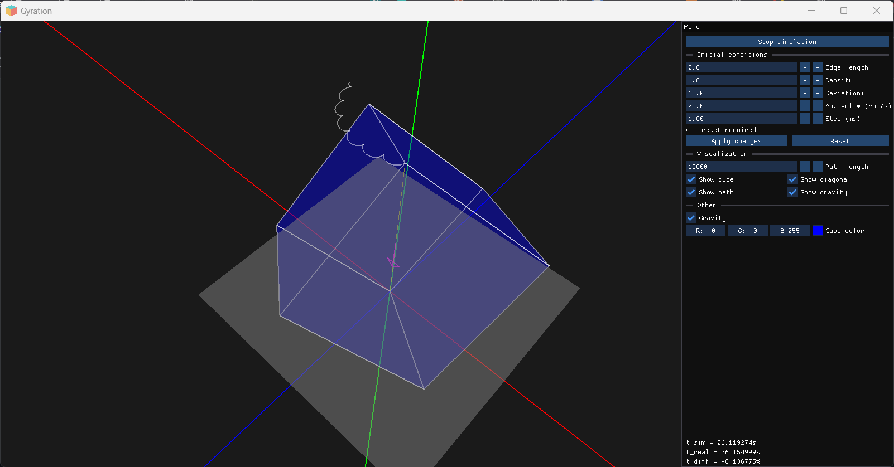

# Rigid Cube Gyration Simulator
The program was developed as part of the course 'Physics Simulations in a Virtual Environment'.

A physics-based simulation of a cube rotating freely while suspended from one of its vertices. Main features:

- Rigid body dynamics with realistic rotation  
- Vertex-based suspension point  
- Angular momentum and torque simulation  
- Real-time 3D visualization  
- Educational demonstration of rotational physics

## Stack
Here is the stack used to develop this piece of software:
### Main:
- C++
- OpenGL (GLSL)
### Dependencies:
- ImGui - UI
- GLFW - windowing
- GLM - math